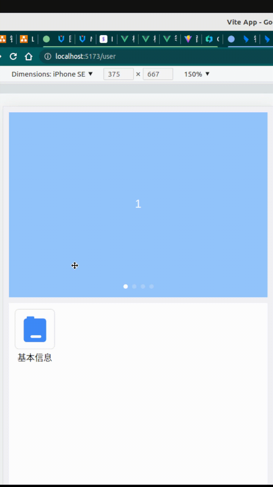

[toc]


## 这是什么？

这是一个 vue@3.x 的自定义指令。 它用于让元素进行 **简单的动画**。


vSimani : v-simple-animate

## 使用指南

1. 安装和引入
2. 使用

````vue
<div v-animate.moveup>
Hello vSimani
</div>
````


### 预定义动画

内置了一些常用的简单动画， 通过修饰符指定

| modifier(支持的修饰符):string | 描述                      | 最终样式状态               |
| ----------------------------- | ------------------------- | -------------------------- |
| scaleup                       | scale from 0 to 1,        | `transform: scale(1)`      |
| fadein                        | opacity from 0 to 1       | `opacity:1`                |
| cleartoblur                   | blur from 0 to 4px        | `drop-filter:blur(4px)`    |
| moveup                        | translateY from 100% to 0 | `transform: translateY(0)` |
| moveupshort                   | translateY from 20% to 0  | `transform: translateY(0)` |
| movefromleft                  | translateX from 100% to 0 | `transform: translateX(0)` |
| movefromleftshort             | translateX from 20% to 0  | `transform: translateX(0)` |

用例：

```vue
<div
  v-animate.scaleup="{
    duration: 0.3,
    timingFunctionL: 'ease-in',
    iterationCount: 'infinite',
  }"
>
    v-animate
</div>
```

### 绑定值

你可以向 `v-animate` 绑定一个 Options 对象， 它支持以下动画属性：

```ts
interface DirectiveBindingValue {
  duration?: number; 
  timingFunction?: string;
  delay?: number;
  direction?: string;
  iterationCount?: string;
  fillMode?: string;
}
```

`value: DirectiveBindingValue`

duration 默认值为之 0.3 , fillMode 默认值为之 both 其他没有默认值


### 怎么让动画逆向运行？

对于反向动画， 你无需重新定义， 仅通过指定 `direction: 'reverse',` 选项即可。

```vue
<div
  v-animate.scaleup="{
    duration: 0.3,
    timingFunctionL: 'ease-in',
    direction: 'reverse',
  }"
>
    v-animate
</div>
```


### 定义你自己的修饰符

在实际项目使用中，你可能需要定义自己的修饰符， 本插件暴露了一个注册方法，请依照以下步骤进行。 


## 注意点: :warning:

>  最终样式状态: 关键帧动画执行到 100% 时的样式状态

如果你没有指定你的动画为 `iterationCount:'infinite'` , 那么你在应用 `v-animate` 的时候需要注意一个 **最终状态样式的问题**

当动画帧从 0% => 100% ， 你所应用的元素， 的指定最终呈现的状态，应该和 100% 关键帧所指定的动画保持一直。 这样才能确保动画流畅，而不会等动画执行完，然后闪到你指定的元素最终样式。

换句话说，就是动画的执行最终

以下是一个示例：

例如，为一个图片做一个从清晰到模糊的动画效果：

有这样的基本解构，

```vue
<div
     :style="{
             backgroundImage: `url(http://192.168.0.166:11180/file${avatar})`,
             }"
     class="bg-cover bg-no-repeat h-28 rounded-md"
     >
    <div
         v-animate.cleartoblur="{ duration: 0.8 }"
         class="img-bg-filter h-full flex justify-center items-center backdrop-blur-0"
         ></div>
</div>
```

注意到： 我们应用 `cleartoblur` 修时符，

这个动画我们是这样定义的：

```css
@keyframes v-animate-cleartoblur {
  0% {
    backdrop-filter: blur(0);
  }
  100% {
    backdrop-filter: blur(4px);
  }
}
```

遮罩的模糊度从 `0` 变到 `4px`

但是我们使用 tailwindcss 将透明遮罩的最终状态设定为了 `backdrop-blur-0`, 即 `blur:0`

这样会出现这样的问题：



为了解决这样的问题， 你应该将 元素的最状态 和 100% 动画关键帧处的状态保持一致：

```vue
<div
     :style="{
             backgroundImage: `url(http://192.168.0.166:11180/file${avatar})`,
             }"
     class="bg-cover bg-no-repeat h-28 rounded-md"
     >
    <div
         v-animate.cleartoblur="{ duration: 0.8 }"
         class="img-bg-filter h-full flex justify-center items-center backdrop-blur-sm"
         ></div>
</div>
```

> `backdrop-blur-sm` (tailwindcss), 即 `backdrop-filter: blur(4px)`


## **额外的：怎么构建你自己的动画指令？**

如果你希望自己构建一套完整的动画指令， 直接修改源代码即可。

### 第 1 步：

在 animate/index.ts

```ts
const animationNameList = {
  scaleup: 'v-animate-scaleup',
  cleartoblur: 'v-animate-cleartoblur',
  //  为了避免和其他元素类名冲突，这里建议使用`v-animate-`开头命名动画名
};
```

在 animationNameList 这个数组中添加一个键值对 ， 他们分别是 `修饰符：@keyframes 动画的名称`

### 第 2 步：

animate/style.css

添加你的关键帧动画， 注意命名需要和上面的保持一致：

```css
@keyframes v-animate-scaleup {
  0% {
    transform: scale(0);
  }
  100% {
    transform: scale(1);
  }
}
@keyframes v-animate-cleartoblur {
  0% {
    backdrop-filter: blur(0);
  }
  100% {
    backdrop-filter: blur(4px);
  }
}
```

### 用例：

修饰符的用法：

```vue

```

> 
